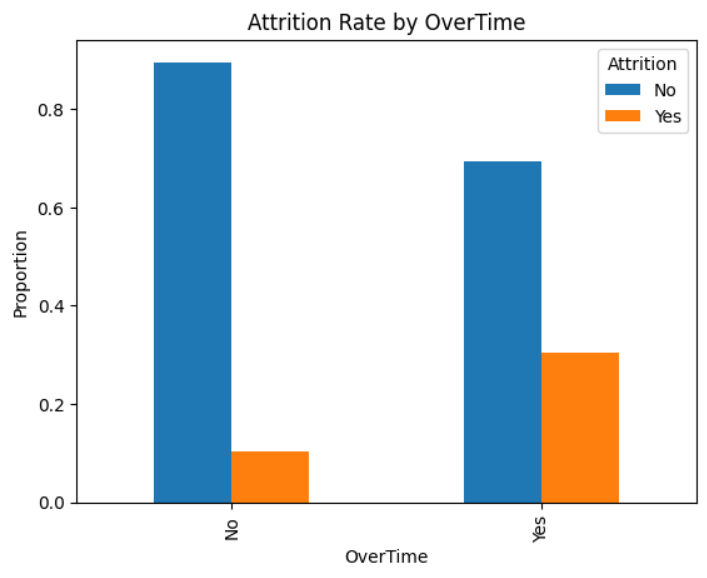
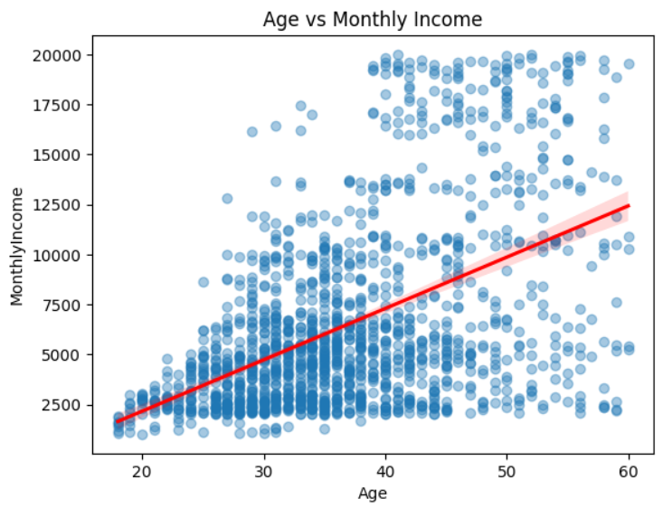
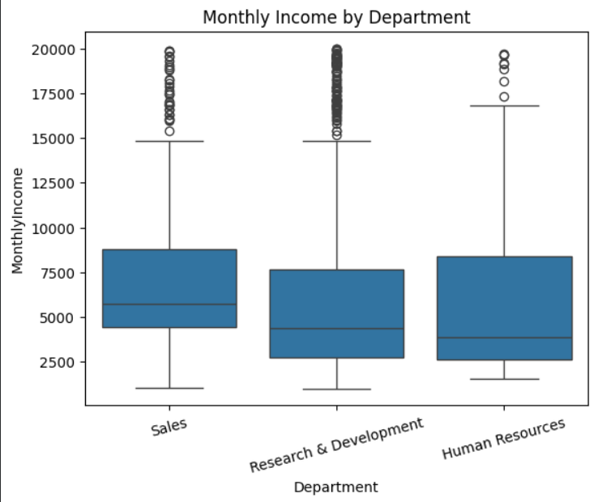

# HR Attrition Analysis: Statistical Hypothesis Testing in Python

Hypothesis testing on the IBM HR Analytics Attrition dataset (1,470 employees) to answer 5 business questions about pay, overtime and employee attrition.

## Dataset
[IBM HR Analytics Employee Attrition & Performance (Kaggle)](https://www.kaggle.com/datasets/pavansubhasht/ibm-hr-analytics-attrition-dataset). It is a fictional dataset created by IBM data scientists.

## Tools
Python, Pandas, NumPy, SciPy, Seaborn, Matplotlib (Google Colab)

## Approach
1. Checked data types and missing values
2. Framed each question as H0 / H1 (significance level α = 0.05)
3. Chose the test based on variable types
4. Interpreted p-values and supported results with charts

## Questions and Results

| # | Question | Test | Result |
|---|----------|------|--------|
| 1 | Does average income differ by gender? | Two-sample t-test | No significant difference (p = 0.22) |
| 2 | Is overtime related to attrition? | Chi-square test | Significant relationship (p < 0.05) |
| 3 | Does average income differ by department? | One-way ANOVA | <fill: p-value and result> |
| 4 | Are age and income related? | Pearson correlation | Moderate positive correlation (r ≈ 0.50, p < 0.05) |
| 5 | Is the average income equal to 6000? | One-sample t-test | <fill: p-value and result> |

## Key Findings
- Employees working overtime leave at about 30%, compared to about 10% for those who do not. Overtime is strongly associated with attrition.
- Age and monthly income show a moderate positive correlation (r ≈ 0.50).
- No statistically significant difference in average income between male and female employees.
- - Average monthly income differs significantly across departments (one-way ANOVA, p < 0.05).

## Charts

### Attrition vs Overtime

### Age vs Monthly Income

### Department vs Monthly Income

## Limitations
- The dataset is fictional, so results should not be generalised to real companies.
- Correlation does not imply causation.

## Files
- `HR_attrition_analysis.ipynb`: full analysis with code, hypotheses, outputs and conclusions
- `Raw Data/`: dataset (source linked above)
- `Screenshots/`: charts used in this README
